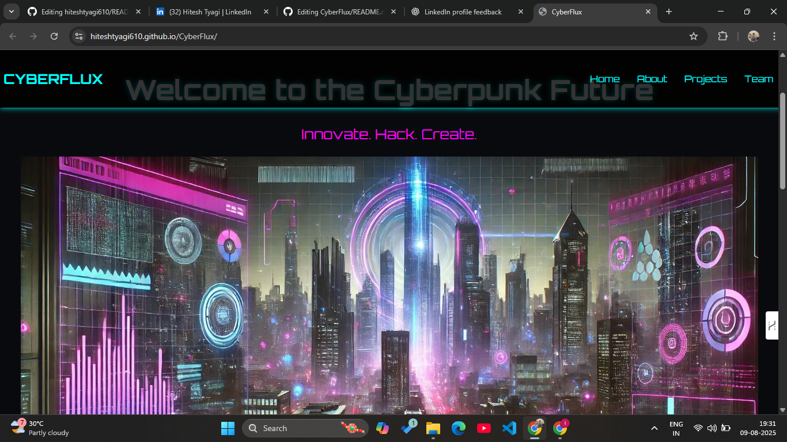

# 🌌 CyberFlux

**CyberFlux** is a vibrant community platform where coders from diverse domains — **AI/ML**, **Cybersecurity**, and **Web Development** — can come together, collaborate, and grow.  
This project features a **modern neon-themed UI** designed to give developers an engaging and futuristic user experience.  
*(Frontend-only project built for a hackathon.)*

---

## 🚀 Live Demo
🔗 [Visit CyberFlux](https://hiteshtyagi610.github.io/CyberFlux/)

---

## ✨ Features
- **Modern Neon UI** for a futuristic feel
- **Category Sections** for AI/ML, Cybersecurity, and Web Development
- Responsive design for seamless usage on all devices
- Built with clean, modular, and reusable code

---

## 🛠️ Tech Stack
- **HTML5**
- **CSS3** (Neon theme & animations)
- **JavaScript** (Dynamic interactions)

---

## 📸 Preview
 <!-- Replace with actual path if screenshot exists -->

---

## 🤝 Contribution
We welcome contributions to enhance CyberFlux!  
If you’d like to add new features, improve UI/UX, or expand categories:
1. Fork the repository
2. Create your branch (`git checkout -b feature-name`)
3. Commit your changes
4. Push to your fork and submit a PR

---

## 📬 Connect with Me
- 💼 [LinkedIn](https://www.linkedin.com/in/hitesh-tyagi-1838a4282/)
- 🖥 [GitHub Profile](https://github.com/hiteshtyagi610)

---

> *CyberFlux was built as part of a hackathon project to foster collaboration and inspire developers from all fields.*
